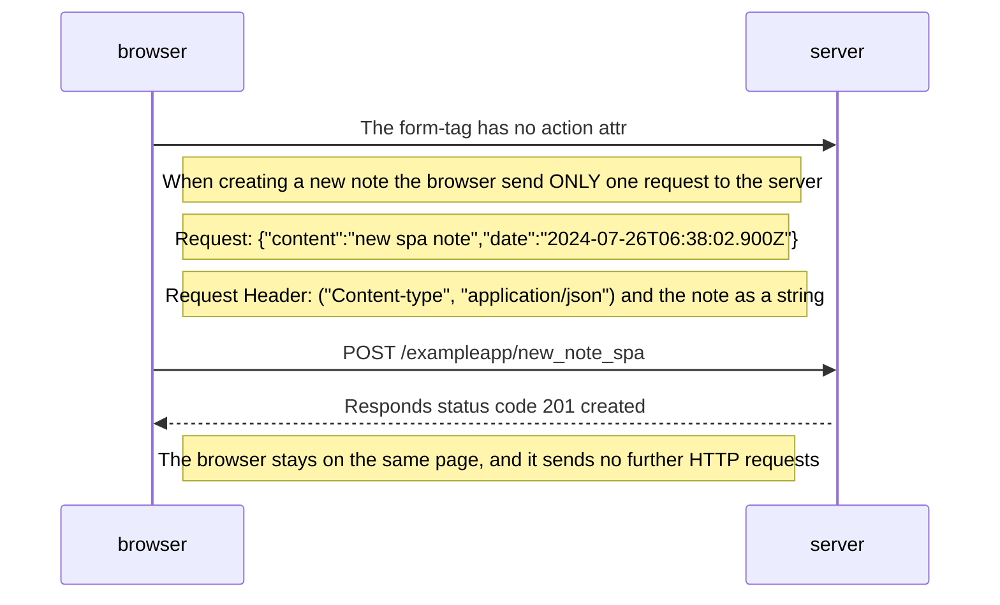

```mermaid
sequenceDiagram
participant browser
participant server

    browser->>server: The form-tag has no action attr
    Note right of browser: When creating a new note the browser send ONLY one request to the server
    Note right of browser: Request: {"content":"new spa note","date":"2024-07-26T06:38:02.900Z"}
    Note right of browser: Request Header:   ("Content-type", "application/json") and the note as a string
    browser->>server: POST /exampleapp/new_note_spa
    activate server
    server-->>browser: Responds status code 201 created
    activate server
    Note right of browser: The browser stays on the same page, and it sends no further HTTP requests
```
